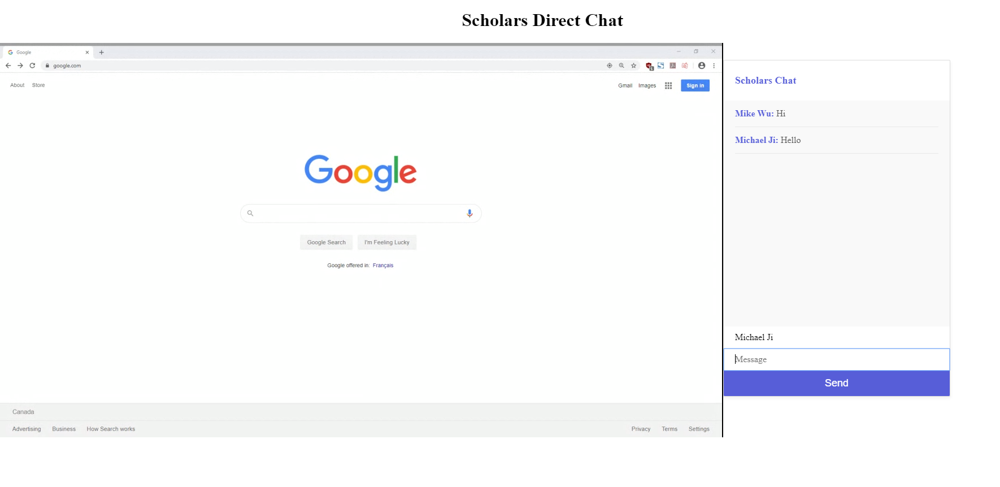
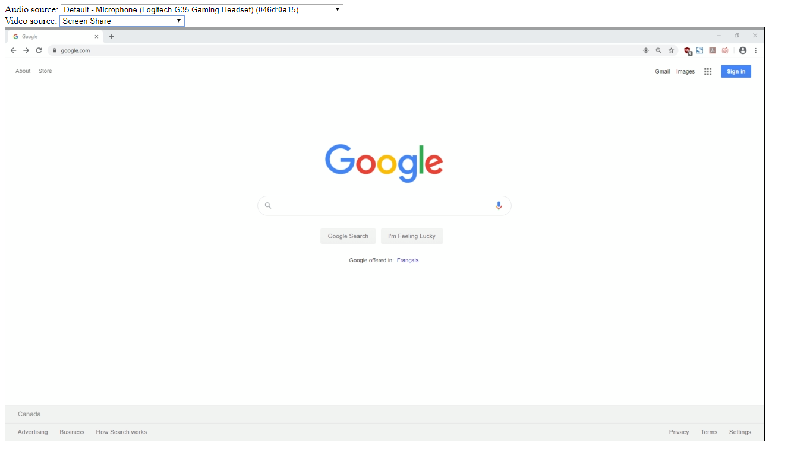

# Scholars-Chat

Scholars-chat is a video calling web application that can stream audio, video, and text 
from any 2 users using a peer-to-peer connection. This application was written using Node.JS,
WebRTC, and socket.io.

## Screenshots

